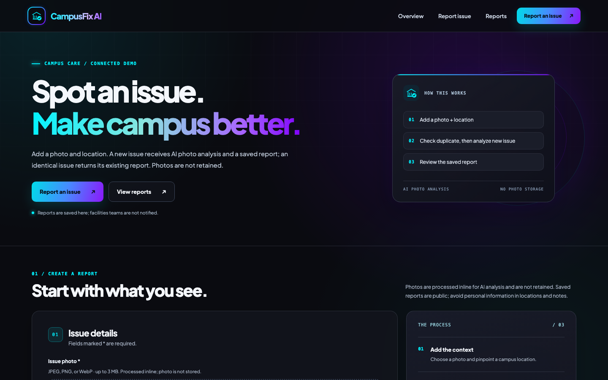
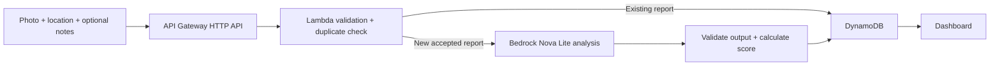
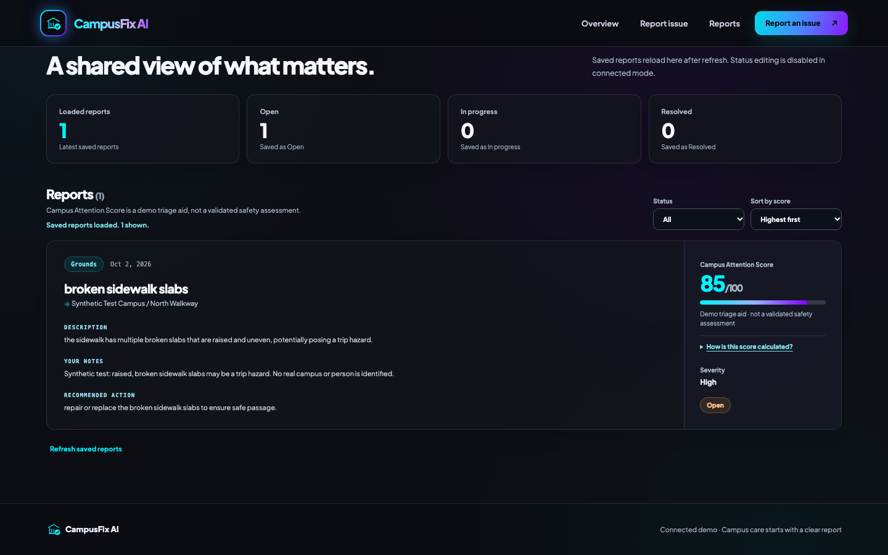

# CampusFix AI



CampusFix AI is a public demo for turning a campus maintenance photo and location into a suggested report with a transparent attention score. **[Open the live app](https://production.d3gggdwgsp652a.amplifyapp.com/).**

## The problem and who it serves

A maintenance concern is easier to review when its location, visible condition, and suggested next step are recorded together. CampusFix AI lets people who notice an issue create that record and gives reviewers a dashboard for comparing saved reports.

## Implemented features

- Photo upload and preview for JPEG, PNG, or WebP; location and optional notes; clear submission and error feedback.
- AI suggestions for title, category, severity, hazard, recurrence, description, and action. The backend checks the model output before saving it.
- A deterministic Campus Attention Score, an explained score breakdown, status filtering, score sorting, report refresh, and “Load more” pagination.
- Exact photo/location duplicate reuse before inference. A failed browser submission is shown as an error and is not automatically retried.
- A separate **Local demo** with sample scenarios and session-only reports; it does not analyze or upload photos.

## Use the live app

1. Open the [connected demo](https://production.d3gggdwgsp652a.amplifyapp.com/) and choose a nonprivate photo of up to 3 MiB.
2. Enter a location and, if useful, notes. Select **Analyze photo**.
3. Review the suggested report and score. The dashboard reloads saved reports after refresh; use **Load more reports** when another page is available. Sorting and filtering apply to reports already loaded in the browser.

Saved reports are public demo data, including their locations and notes. Avoid personal information. Anonymous status editing is disabled in connected mode.

## Architecture and request workflow



**Amplify Hosting** serves the static Vite site. **API Gateway** exposes `POST /reports` and `GET /reports`, applies exact-origin browser CORS, and throttles requests. **Lambda** checks the image and fields, handles duplicate and daily-limit logic, calls **Bedrock Nova Lite** for a new accepted report, validates the seven analysis fields, and calculates the score. **DynamoDB** stores report text, scores, temporary processing markers, and daily inference-attempt counts; `GET /reports` returns up to 50 newest ready reports per page with an opaque cursor. **S3** stores Lambda deployment code only. Submitted photos pass inline through the API and Lambda to Bedrock and are not retained. **IAM** limits the Lambda role, **CloudWatch Logs** hold sanitized diagnostics, and **CloudFormation** manages the backend resources.

Duplicate matching hashes the **decoded image bytes**, a NUL separator, and the location after trimming, lowercasing, and collapsing whitespace. A ready report with that SHA-256 fingerprint is returned without another model call or counter increase. An in-progress match returns HTTP 409. Notes do not affect the fingerprint; changing only notes returns the existing report. The check does not compare visual similarity: recompressed or edited image bytes, or a different normalized location, can create a new report. An expired processing lease can be reclaimed after a failed run, so the design does not promise exactly-once billing.

The score starts at **25 / 50 / 70** for Low / Medium / High severity, adds **15** for a hazard and **5** for recurrence, and is capped at 100. With the currently allowed inputs, its possible range is **25–90**. It is a sorting aid, not a safety assessment.

## Local setup and configuration

Use Node.js 22.12+ and npm from the repository root:

```sh
npm ci
npm --prefix backend ci
npm test
npm run dev
```

`npm run dev` opens the **Local demo** at `http://localhost:5173` when no development `VITE_API_URL` is set. It uses predefined sample facts, keeps reports only in browser memory, and permits status changes only for those local samples. `npm run build` creates a connected production build in `dist/` using the public API URL in [`.env.production`](.env.production); `npm run preview` serves that build locally. The deployed API currently allows the hosted Amplify origin in browser CORS, so local preview cannot load connected reports without a reviewed CORS change. The API URL is public configuration, not a credential.

## Verification

- **Live backend:** One controlled sidewalk photo produced all seven validated analysis fields, a score of **85** (High 70 + hazard 15), and a report retrieved through the API and checked in DynamoDB. One identical duplicate returned the same report without another inference attempt; the application counter was **4 → 5 → 5**. This verifies one example, not general model reliability.
- **Mocked and local:** All **23 repository tests** passed, covering model-output validation, scoring, duplicate handling, pagination, and failed submissions without automatic retry. The connected production build passed.
- **Hosted browser and API:** The public page and assets matched the verified build; CORS preflight and saved-report GET passed. Headless Chrome rendered the connected wording and saved report without a status editor. A 390-pixel mobile viewport had no horizontal overflow. These checks did not submit another photo.



## Limits and cost controls

The live API has no user authentication. Reports are public, and **facilities teams are not notified or dispatched**. AI classifications can be wrong or fail validation; one successful live example does not establish a success rate. New model calls are limited by a 20-attempt daily application counter, one Bedrock SDK attempt, image-size checks, API throttling, and duplicate reuse. These controls and the existing billing alert are not spending caps. AWS usage and Free Plan eligibility should be checked before future deployments.

## Supporting documentation

- [Development milestones and verified evidence](docs/progress.md)
- [Backend architecture, configuration, deployment, and cleanup](docs/backend.md)
- [Amplify deployment record and hosting procedure](docs/amplify-hosting-plan.md)
- [Mobile screenshot](docs/screenshots/campusfix-mobile.png) and AWS MCP evidence: [connection](docs/screenshots/aws-mcp-connected.png), [read-only identity check](docs/screenshots/aws-mcp-identity-check.png)
