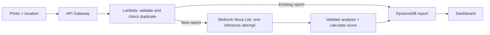
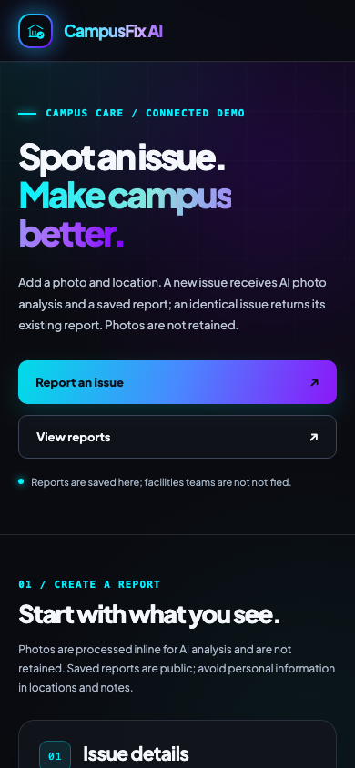
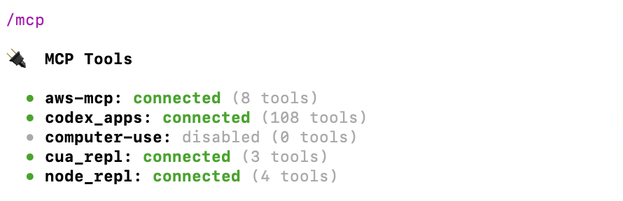
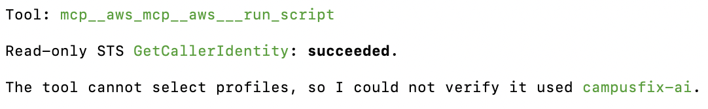

# CampusFix AI

CampusFix AI is a campus maintenance reporting demo. A photo and location can become a suggested report with a transparent attention score. The dashboard helps people review issues, but it does not notify a facilities team or replace an inspection.

**Public demo:** https://production.d3gggdwgsp652a.amplifyapp.com/

## What it does

- Accepts a JPEG, PNG, or WebP photo, a location, and optional notes.
- Checks whether the same photo and normalized location already have a report before requesting AI analysis.
- Uses Amazon Nova Lite to suggest seven report fields for a new issue: title, category, severity, hazard, recurring, description, and action. The backend validates every field and rejects unusable output.
- Calculates a deterministic Campus Attention Score: Low / Medium / High contributes 25 / 50 / 70 points, hazard adds 15, recurring adds 5, and the result is capped at 100. It is a triage aid, not a safety rating.
- Displays saved reports with sorting, status filtering, refresh, and paginated loading.

## Workflow



The backend accepts the image bytes inline through API Gateway and Lambda, passes them inline to Bedrock for a new report, and does **not** retain photos. DynamoDB stores report text, score, status, and temporary processing/quota records. The existing S3 bucket stores Lambda deployment code only, not submitted photos.

Duplicate detection uses SHA-256 over the decoded photo bytes, a NUL separator, and the location after trimming, lowercasing, and collapsing whitespace. A completed report with that fingerprint is returned without incrementing the inference counter or calling Bedrock. A matching submission still being processed receives HTTP 409; a stale processing lease can be reclaimed. Notes are not part of the fingerprint, so changing only notes does not create another report. Different image bytes or a different normalized location can create a new report.

## Connected mode and local demo

The production build has the deployed API URL in [`.env.production`](.env.production). **Connected demo** sends the photo to the public AWS API, requests AI analysis only for a new fingerprint, and loads persistent reports from DynamoDB. Anyone with the API URL can read reports, so use nonprivate demo data. Anonymous status editing is disabled. Failed submissions show an error; the browser does not retry automatically. If the connection drops, the outcome may be unknown, so check saved reports before submitting again.

Run `npm run dev` without a development API URL for **Local demo**. It does not upload or analyze the photo. The selected sample scenario supplies the report facts, and reports exist only in browser memory until refresh. Status editing is available only in this local mode.

One controlled live test on October 2, 2026 returned a report for a damaged sidewalk with `Grounds`, `High`, hazard `true`, recurring `false`, and score **85**. The report was retrieved from the API and checked in DynamoDB. An identical second submission returned that report without another inference attempt; the application counter went **4 → 5 → 5**. This verifies one example, not the reliability of every future model response. See [the progress log](docs/progress.md) for test history and diagnostics.

## Run locally

Use Node.js 22.12+ and npm. From the repository root:

```sh
npm ci
npm --prefix backend ci
npm test
npm run dev
```

Open `http://localhost:5173` for the local demo. `npm run build` creates the connected production site in `dist/`; `npm run preview` previews that build. Browser CORS currently allows the hosted Amplify origin, so a local connected browser build needs a reviewed CORS change before it can call the deployed API.

## AWS deployment and costs

The deployed backend in `us-east-1` uses API Gateway HTTP API, Lambda, Bedrock Nova Lite, DynamoDB with point-in-time recovery, CloudWatch Logs, CloudFormation, IAM, and an S3 bucket for Lambda artifacts. The static frontend is hosted on AWS Amplify at the public URL above. It uses Amplify's default HTTPS address, with no custom domain or Amplify backend. The existing API allows that exact hosted origin. See the [hosting record](docs/amplify-hosting-plan.md) for the deployment steps and cost estimate.

Cost controls include one Bedrock SDK attempt per new submission, a 20-attempt daily application limit, API throttling at one request per second with burst two, duplicate reuse, and image size limits. These controls are not a spending cap. Hosting, API, Lambda, Bedrock, DynamoDB, logs, and artifact storage can incur usage; Free Plan eligibility and remaining credits should be rechecked before future deployments. The API has no user authentication, and reports are public demo data. AI classifications may be wrong; status changes are unavailable in connected mode.

## Evidence and screenshots

These are actual screenshots of the hosted connected demo, captured after its saved report loaded. The report-result screenshot shows the verified synthetic sidewalk example.





The earlier AWS MCP evidence shows the connected tooling and a read-only identity check.




